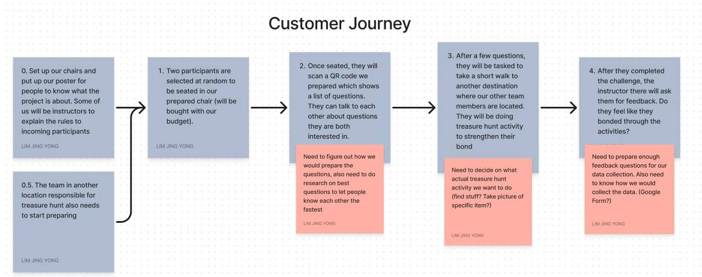
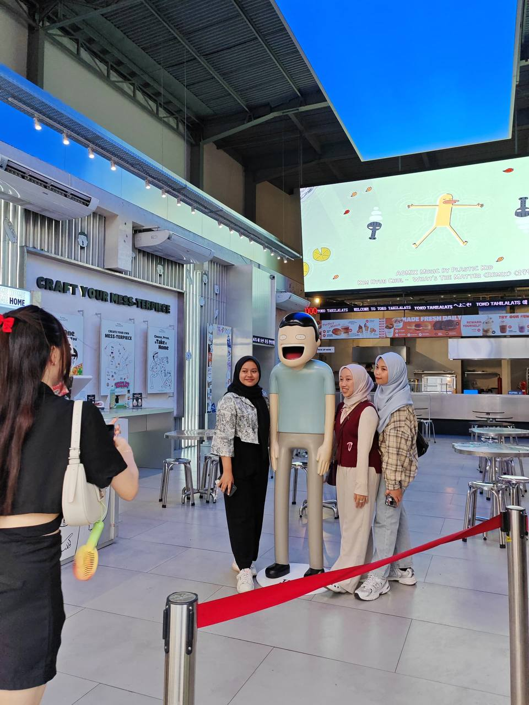
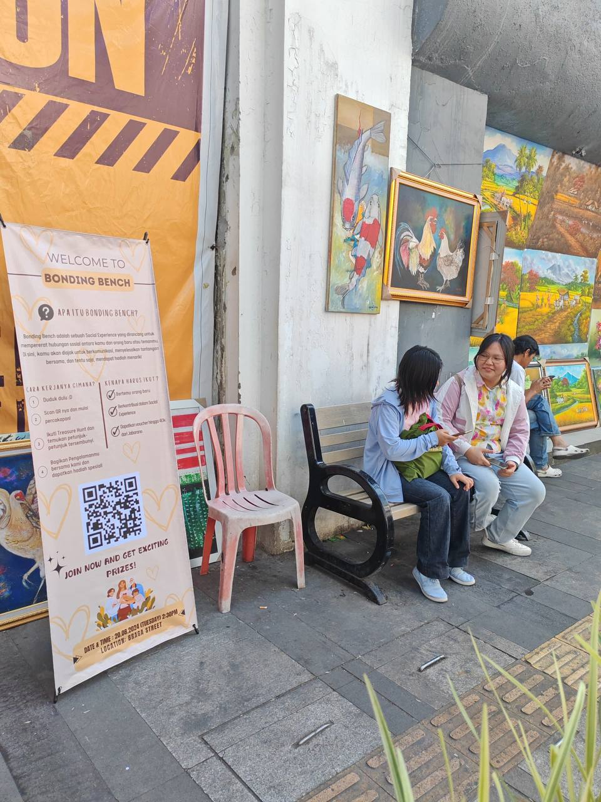
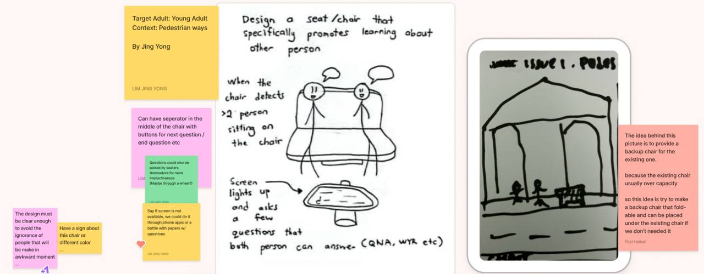

  

# 🚸 Bonding Bench | Braga Street Smart Health System

Collaboration between the University of Technology Malaysia, Taylor's University, and Institut Teknologi Bandung (ITB) in Indonesia, aimed at advancing smart systems technology. This focuses on innovative development to create sustainable and efficient solutions for users by making new connections and finding checkpoints around Braga Street via QR codes. The main benefit for the users is to encourage walking and physical activity by exploring the checkpoints to find them.

## Team Members
- ALIATUL IZZAH BINTI JASMAN (UTM)
- BERNICE LIM JING XUAN (UTM)
- CHIN YONG SI (TAYLOR'S)
- ERICA DESIRAE MAURITIUS (UTM)
- JASMINE CALLISTA AURELLIE I (ITB)
- LIM JING YONG (UTM)
- MOH FIQRI HAIKAL (ITB)

## Objectives of the Project
- Make the pair of participants get to know each other more through the process of the games
- The pair of participants get to know more about what is around the Braga street
- Encourage walking and physical activity by exploring the checkpoints

## Flow of the Project
  

## Scan to Access The Instructions and Questions
  

## Pictures During Event
  

## Project Proposal
[View Project Proposal](https://github.com/oishylea/BondingBench/raw/main/file/ProjectProposal.pdf)

## Initial Idea
  

